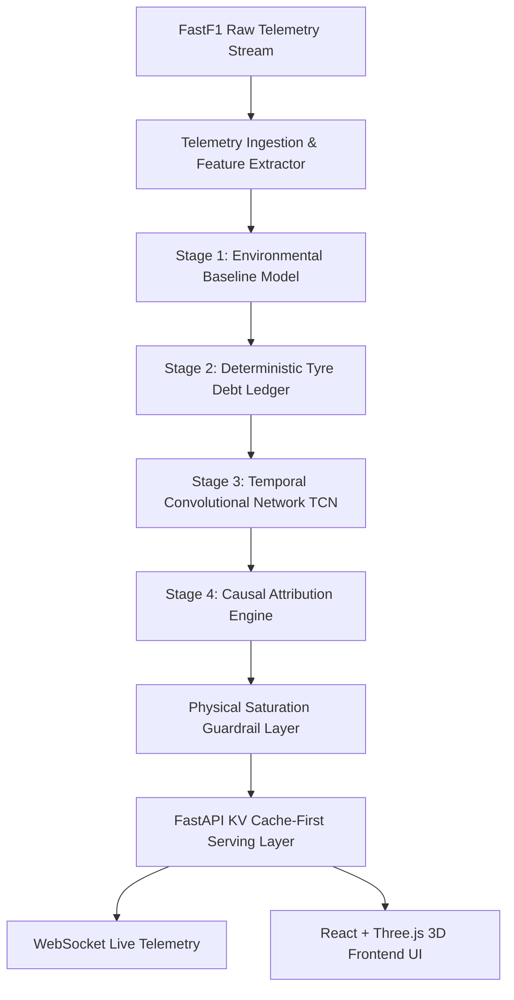

# TrackShift — Formula 1 Telemetry & Tyre Debt Intelligence 🏎️💨

[](https://fastapi.tiangolo.com)
[](https://reactjs.org)
[](https://pytorch.org)
[](https://github.com/theOehrly/Fast-F1)
[](https://vitejs.dev)
[](LICENSE)
[-brightgreen.svg)](#-testing--benchmarks)

> **A Hybrid Classical ML + Temporal Deep Learning Intelligence Platform for Formula 1 Tyre Degradation Modeling, Causal Attribution, and Real-Time Driver Coaching.**

---

## 📑 Table of Contents

- [Overview & The "Tyre Debt" Concept](#-overview--the-tyre-debt-concept)
- [Key Features](#-key-features)
- [Architecture & ML Pipeline](#-architecture--ml-pipeline)
  - [Mathematical Formulation](#mathematical-formulation)
  - [System Flow](#system-flow)
- [Project Structure](#-project-structure)
- [Quickstart & Installation](#-quickstart--installation)
  - [Prerequisites](#prerequisites)
  - [1. Backend Setup](#1-backend-setup)
  - [2. Frontend Setup](#2-frontend-setup)
  - [3. Run the Platform](#3-run-the-platform)
- [API Reference](#-api-reference)
- [Real-Time Telemetry Simulation](#-real-time-telemetry-simulation)
- [Testing & Benchmarks](#-testing--benchmarks)
- [Offline Demo Mode](#-offline-demo-mode)
- [License](#-license)

---

## 🏁 Overview & The "Tyre Debt" Concept

In modern Formula 1, tire degradation is the single largest determinant of race strategy and pace. Conventional telemetry tools analyze degradation retrospectively as a flat linear lap-time loss. However, real degradation is **non-linear, multi-factorial, and driver-induced**.

**Tyre Debt** is TrackShift's proprietary metric that isolates driver-induced tire wear from environmental baselines:
1. **Environmental Baseline ($\hat{y}_{\text{env}}$)**: Expected lap pace given fuel weight loss, track temperature evolution, compound hardness, and baseline track abrasion.
2. **Behavioral Residual ($\Delta y_{\text{residual}}$)**: Delta between actual pace and environmental baseline.
3. **Cumulative Tyre Debt ($D_t$)**: The accumulated non-linear thermal and mechanical strain injected into the tire carcass due to aggressive throttle applications, micro-locking under braking, and high lateral slip angles in high-energy corners.

TrackShift empowers race engineers and drivers to decompose lap-time deltas into concrete driving behaviors and simulate **physically-bounded counterfactuals** (e.g., *"If Hamilton softened corner entry at Turn 4 by 8%, how many laps could this Medium stint extend before hitting the thermal cliff?"*).

---

## ✨ Key Features

- 🌍 **Interactive 3D Globe & Circuit Explorer**: WebGL/Three.js interactive earth with day/night topology maps, real-time circuit pins, and dynamic telemetry overlays across 13+ global F1 circuits.
- 🏎️ **Live Driver Cockpit HUD & Multi-Layer Circuit Map**: High-frequency telemetry tracking showing GPS delta, micro-sectors, brake/throttle traces, lateral G-forces, RPM, and gear selection.
- 🧠 **4-Stage Hybrid ML + Deep Learning Engine**:
  - **Stage 1 (Environmental Baseline)**: `HistGradientBoostingRegressor` modeling physics priors (fuel burn ~0.06s/lap, compound delta, track temp $\Delta$).
  - **Stage 2 (Tyre Debt Ledger)**: Cumulative residual tracking across stints with outlier filtering and safety car neutralization.
  - **Stage 3 (Temporal Convolutional Network - TCN)**: Dilated causal convolutions extracting latent driver behavioral representations ($z \in \mathbb{R}^{16}$).
  - **Stage 4 (Causal Attribution)**: Interpretable decomposition attributing debt to specific driving habits (Cornering Energy, Braking Aggression, Throttle Overdrive).
- 🛡️ **Physical Saturation Guardrails**: Bounded non-linear activation functions ($R_{\max} \cdot \tanh(R_{\text{lin}} / R_{\max})$) preventing unphysical predictions when evaluating extreme driver counterfactuals.
- 📊 **Bootstrap Uncertainty & Cliff Estimation**: Non-parametric bootstrap resampling calculating $95\%$ confidence intervals on tire degradation rates and cliff lap windows.
- ⚡ **Sub-Millisecond KV Cache Layer**: Tiered Redis / In-Memory cache architecture with Single-Flight locks to prevent cache stampedes under high concurrency.
- 📡 **WebSocket Telemetry Streaming**: High-throughput live telemetry streaming engine capable of 1x to 10x race replay simulation.

---

## 🏗️ Architecture & ML Pipeline

### Mathematical Formulation

$$\text{Lap Residual: } r_t = \text{LapTime}_t - \hat{y}_{\text{baseline}}(\text{Fuel}_t, T_{\text{track}}, \text{Compound})$$

$$\text{Cumulative Debt: } D_t = \sum_{\tau=1}^{t} \max(0, r_\tau)$$

$$\text{TCN Representation: } \mathbf{z}_t = \text{TCN}(\mathbf{x}_{1:t}; \Theta_{\text{TCN}}), \quad \mathbf{z}_t \in \mathbb{R}^{16}$$

$$\text{Attribution: } \hat{D}_t = \mathbf{w}^T \mathbf{z}_t + \beta_1 E_{\text{lat}} + \beta_2 A_{\text{brake}} + \beta_3 \Omega_{\text{throttle}}$$

$$\text{Bounded Counterfactual: } \Delta \text{Time}_{\text{pred}} = R_{\max} \cdot \tanh\left(\frac{\mathbf{w}^T \Delta \mathbf{z}}{R_{\max}}\right)$$

### System Flow



---

## 📂 Project Structure

```text
TrackShift-F1/
├── api/                              # FastAPI Backend & Serving Layer
│   ├── cache/                        # Tiered KV Caching Service (Redis/Memory LRU)
│   ├── jobs/                         # Offline Precomputation & Cache-Warming
│   ├── models/                       # PyTorch TCN architectures & Model Registry
│   ├── routers/                      # Circuits, Stints, Signatures, Admin endpoints
│   ├── services/                     # Domain services (TyreDebt, Counterfactuals)
│   ├── schema.sql                    # SQLite database schema
│   └── main.py                       # FastAPI entrypoint & WebSocket handlers
│
├── pipeline/                         # ML Pipeline & Feature Engineering
│   ├── circuit_geometry.py           # GPS coordinate projection & apex extraction
│   ├── features.py                   # High-frequency telemetry signal processing
│   ├── ingest.py / multicircuit_ingest.py # Multi-year FastF1 session loader
│   ├── model_stage1.py               # Environmental Baseline model (HistGradientBoosting)
│   ├── model_stage2.py               # Tyre Debt Ledger calculation
│   ├── model_stage3.py               # Stage 3 Temporal DL & attribution engine
│   ├── train_stage3_tcn.py           # PyTorch TCN training routine
│   └── uncertainty_bootstrap.py      # Non-parametric bootstrap interval estimation
│
├── frontend/                         # React 19 + Vite Frontend
│   ├── public/                       # Driver portraits, 3D textures, offline JSON data
│   ├── src/
│   │   ├── components/               # 3D Globe, CircuitMap, HUD, Leaderboard
│   │   ├── screens/                  # Circuit Selector, Session Picker, Dashboard
│   │   ├── context/                  # Circuit & Session state management
│   │   ├── api.js                    # API client with automatic offline demo fallback
│   │   └── App.jsx                   # Application router
│   └── package.json                  # Frontend dependencies
│
├── data/                             # Baseline parquets & circuit geometry datasets
├── docs/                             # Engineering specs, Architecture, & PRDs
├── models/                           # Saved PyTorch TCN checkpoints & metadata
├── reports/                          # Scientific model comparisons & validation reports
├── scripts/                          # PDF Report generators (ReportLab)
├── tests/                            # Automated test suite (Pytest)
├── benchmark.py                      # Latency & throughput stress-testing suite
├── dump_offline.py                   # Offline demo generator for static deployments
├── seed.py                           # Database initialization & seed script
├── simulate_live.py                  # Live WebSocket telemetry replay simulator
├── requirements.txt                  # Python dependencies
└── package.json                      # Workspace root scripts
```

---

## 🚀 Quickstart & Installation

### Prerequisites
- **Python 3.10+**
- **Node.js 18+** & **npm**

### 1. Backend Setup

```bash
# Clone the repository
git clone https://github.com/Harshit-it25/Trackshift-F1.git
cd Trackshift-F1

# Create and activate Python virtual environment
python -m venv venv
# On Windows:
.\venv\Scripts\activate
# On Linux/macOS:
source venv/bin/activate

# Install Python dependencies
pip install -r requirements.txt

# Seed the database and generate metadata
python seed.py
```

### 2. Frontend Setup

```bash
# Install frontend dependencies
npm --prefix frontend install
```

### 3. Run the Platform

You can run the backend and frontend using either npm workspace commands or standalone processes:

#### Option A: Using Workspace Commands
```bash
# Start FastAPI backend (port 8000)
npm run api

# In another terminal, start React frontend (port 5173)
npm run dev
```

#### Option B: Standalone Terminal Commands
```bash
# Terminal 1: Backend
uvicorn api.main:app --reload --port 8000

# Terminal 2: Frontend
cd frontend
npm run dev
```

Open [http://localhost:5173](http://localhost:5173) in your browser to explore the dashboard!

---

## 🔌 API Reference

| Method | Endpoint | Description |
|---|---|---|
| `GET` | `/api/circuits` | List all available circuits with GPS metadata |
| `GET` | `/api/circuits/{circuit_id}/geometry` | High-resolution track coordinates, DRS zones, and corner apices |
| `GET` | `/api/circuits/{circuit_id}/sessions` | Sessions available for a circuit |
| `GET` | `/api/stints/{session_id}` | All driver stints in a session with compound information |
| `GET` | `/api/stints/{stint_id}/ledger` | Tyre Debt ledger with baseline pace, actual pace, and cumulative debt |
| `GET` | `/api/stints/{stint_id}/attribution` | ML behavioral attribution breakdown and feature contributions |
| `POST` | `/api/stints/{stint_id}/counterfactual` | Run bounded counterfactual coaching simulations |
| `GET` | `/api/signatures/{driver_code}` | Driver behavioral fingerprint across tracks |
| `WS` | `/ws/live/{session_id}` | Real-time telemetry WebSocket streaming |

---

## 📡 Real-Time Telemetry Simulation

TrackShift includes a real-time race telemetry replay engine that simulates live telemetry broadcast over WebSockets:

```bash
# Stream real-time telemetry for Max Verstappen's stint at Monza
python simulate_live.py 2024_monza_R_VER_1 --speed 2.0
```

The frontend cockpit HUD will automatically update with live speed, throttle, brake pressure, and delta-to-apex calculations in sync with the replay stream.

---

## 🧪 Testing & Benchmarks

Run the complete test suite to verify pipeline integrity, temporal DL architectures, and cache mechanisms:

```bash
# Run all unit and integration tests
python -m pytest tests -v

# Run API latency and concurrent throughput benchmark
python benchmark.py
```

---

## 🌐 Offline Demo Mode

TrackShift is designed to work seamlessly in air-gapped or static preview environments. If the backend server is unreachable, the frontend automatically switches to **Offline Demo Mode**, utilizing precomputed telemetry files in `frontend/public/demo_offline/`.

To regenerate offline demo data from active sessions:
```bash
python dump_offline.py
```

---

## 📄 License

This project is licensed under the MIT License — see the [LICENSE](LICENSE) file for details.
