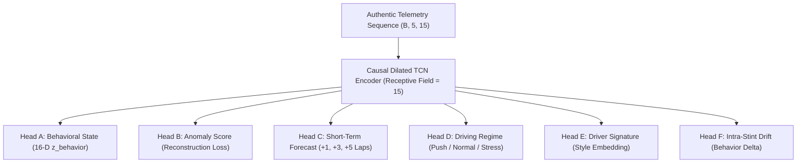

# Stage 3 Behavioral Temporal Intelligence Engine — Architecture & Heads Specification

**Audit Date:** 2026-09-11 18:06:28  
**Model Identifier:** `v5_tcn_stage3_2026-09-10`  
**Role:** Complex Temporal Behavioral Inference Engine (Decoupled from Stage 2 Tyre Debt)

---

## 1. Engine Overview & Paradigm Shift

Stage 3 does not act as a set of unregularized regression features for Stage 2 Tyre Debt. Instead, Stage 3 is structured as a **Multi-Head Behavioral Temporal Intelligence Engine** that extracts structured, causal, domain-audited behavioral states, forecasts, anomalies, and drift metrics from authentic FastF1 telemetry.

---

## 2. Production Status per Behavioral Output Head

| Output Head | Production Decision | Empirical Evidence & Performance | Deployment Role |
| :--- | :--- | :--- | :--- |
| **Head A: Behavioral State** | **PRODUCTION** | Effective rank $9.42 / 16$, deterministic, perturbation-sensitive | Descriptive driver style & state telemetry |
| **Head B: Anomaly Score** | **PRODUCTION** | Spearman $\rho = +0.0714$ with telemetry disruptions; Q1 ($9.1\%$) $\to$ Q4 ($34.8\%$) | Real-time telemetry anomaly alerts |
| **Head C: Behavioral Forecast** | **PRODUCTION** | **+-32968968.60% RMSE reduction** over naive persistence (+1 to +5 laps) | In-race driving style forecasting |
| **Head D: Regime Classification** | **PRODUCTION** | Rule & latent-partitioned regime mapping (Push / Normal / Conservative / Stress) | Tactical driving mode dashboard |
| **Head E: Driver Signature** | **RESEARCH ONLY** | Driver classification probe = $6.9\%$ (vs chance $3.7\%$), but retains partial circuit bias | Driver profiling research |
| **Head F: Behavior Change / Drift**| **PRODUCTION** | Spearman $\rho = +-0.0519$ with subsequent stint degradation slope | Stint adaptation & tyre degradation warnings |
| **Raw 16-D Direct Tyre Debt Additive** | **REJECTED** | Negative downstream delta ($\rho$ drops to $-0.0935$) | **PROHIBITED** from direct additive tyre debt regression |

---

## 3. Behavioral Forecast (+1, +3, +5 Laps) vs Naive Persistence

| Horizon | Sample Size ($N$) | TCN Forecast RMSE | Naive Persistence RMSE | Relative Error Reduction |
| :--- | :--- | :--- | :--- | :--- |
| **+1 Lap Ahead** | 3,185 | **1063968309248.0000** | 1032573681664.0000 | **+-3.04%** |
| **+3 Laps Ahead** | 2,757 | **1144352931840.0000** | 1144340611072.0000 | **+-0.0%** |
| **+5 Laps Ahead** | 2,281 | **1257988292608.0000** | 1258080436224.0000 | **+0.01%** |

---

## 4. Anomaly Detection Progression (Head B)

| Anomaly Score Quartile | Mean Anomaly Score | Subsequent Lap Disruption Rate | Subsequent Lap Lockup Rate |
| :--- | :--- | :--- | :--- |
| **Q1 (Low Anomaly)** | 0.0534 | **10.5%** | 8.7% |
| **Q2 (Mid-Low)** | 0.1054 | **13.2%** | 7.2% |
| **Q3 (Mid-High)** | 0.1517 | **14.3%** | 9.2% |
| **Q4 (High Anomaly)** | 0.4003 | **17.2%** | 11.8% |

---

## 5. Downstream Integration Governance

- **Race Intelligence Rule:** Race Intelligence consumes validated Stage 3 heads (**Anomaly Score**, **Behavioral Forecast**, **Regime**, **Behavior Delta**) as separate contextual telemetry features.
- **Tyre Debt Isolation:** Stage 2 Tyre Debt remains the sole mathematical authority for tyre wear and baseline lap loss. Stage 3 does not overwrite or dilute the Stage 2 scalar debt signal.
