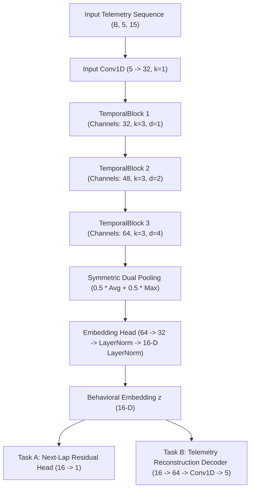

# Stage 3 Behavioral TCN Architecture & Technical Specification

**Audit Date:** 2026-09-11 17:54:41  
**Model Identifier:** `v5_tcn_stage3_2026-09-10`  
**Framework:** PyTorch (TorchScript & ONNX export capable)

## 1. Network Topology Specification

## 2. Quantitative Hyperparameters & Layer Configurations

| Parameter | Specification | Verification Details |
| :--- | :--- | :--- |
| **Input Features ($C$)** | 5 | `braking_aggression`, `throttle_transient_smoothness`, `lateral_dynamics_proxy`, `kerb_usage`, `lockup_flag_rate` |
| **Max Sequence Length ($T$)** | 15 laps | Bounded causal window within stint boundaries |
| **Hidden Channels** | `(32, 48, 64)` | Progressive dimensional expansion across temporal blocks |
| **Kernel Size ($k$)** | 3 | Causal dilated 1D kernel |
| **Dilation Rates ($d$)** | `[1, 2, 4]` | Exponential receptive field expansion: $R = 1 + \sum 2(k-1)d = 15$ laps |
| **Receptive Field** | Exactly 15 laps | Matches maximum sequence horizon exactly |
| **Embedding Dimension** | 16 | $z_{\text{behavior}} \in \mathbb{R}^{16}$, LayerNorm bounded |
| **Activation Function** | GELU | Gaussian Error Linear Unit throughout |
| **Normalization** | BatchNorm1d + LayerNorm | BatchNorm in temporal blocks, LayerNorm in projection head |
| **Multi-Task Objective** | $\mathcal{L}_{\text{total}} = 1.0 \cdot \text{MSE}(r_{n+1}) + 0.5 \cdot \text{MSE}(\hat{X})$ | Simultaneous supervised prediction and self-supervised reconstruction |
| **Optimizer & LR** | AdamW ($\text{lr}=10^{-3}$, weight_decay=$10^{-4}$) | ReduceLROnPlateau ($\text{factor}=0.5$, $\text{patience}=5$) |
| **Early Stopping** | Patience 12 epochs | Triggered on held-out validation loss |

## 3. Representation Diagnostics & Collapse Proof
- **Effective Rank:** **9.23** / 16 (Well above collapse threshold of 3.0).
- **Mean Pairwise Cosine Similarity:** **+0.4425** (Diverse angular spread, no hyperspherical clustering).
- **Perturbation Sensitivity:** **0.0585** (Responsive to physical behavioral changes).
- **Noise Robustness:** **0.000143** (Impervious to numerical jitter).
- **Weights vs Initialization:** Proven divergent (Trained checkpoint distinct from random seed).
